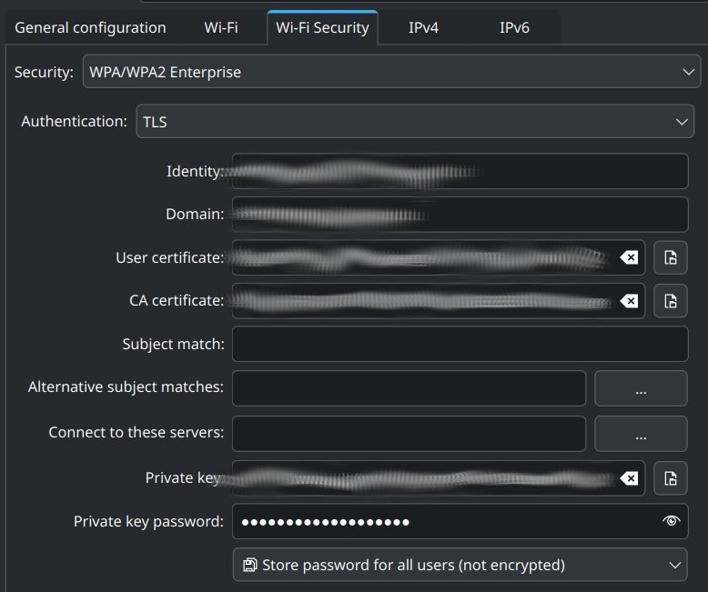

I recently had the displeasure of trying to get my laptop to connect to the
college Wi-Fi after they tightened their restrictions on endpoint management.
Long story short, I was forced to switch from Arch to Fedora, and I feel the
need to document the experience so that nobody will ever have to go through what
I did to avoid crawling back to Windows with my tail between my legs.

## Why are we even doing this?

Normally using endpoint management software is annoying, but painless. Install a
program, run it, it configures some stuff behind the scenes, you're good to go.
However, this only works if you're using a system the developers expect their
customers to use. Since the vast majority of them use Windows, any Linux
versions are janky at best and non-functional at worst. Thankfully, my college
offered a work-around for "miscellaneous devices", set up the whole thing
manually.

The process of configuring a secure connection manually is a bit overwhelming,
but it's ultimately just putting squares in the square hole and circles in the
circle hole. Your organization will provide all of these, though sometimes under
different names, because god forbid anything about this be easy. Anyway, last
year a change was made at my college, requiring not just the identity, domain,
certificates and private key, but also a background service called "Fortinac
Persistent Agent". Only problem? It only offered .deb and .rpm files. Hardly
surprising, the only reason they had _any_ Linux support was for Raspberry Pi
projects. Regardless, that meant I had to distrohop yet again.

## The actual solution

When signing in through their web portal, Fortinac offered automatic
configuration programs for Ubuntu and Fedora. I will never know if they actually
work or if I was just doing something wrong, because they only ever did jack
shit for me. No, the actual solution was a lot closer to the manual setup I'd
been doing before.

1. Install Fedora. Stock standard install, nothing special that would need to be
   covered here.
2. Configure Wi-Fi manually. Same as before, download certificates and keys,
   plug in my credentials, and that _should_ be the end of it
3. Download .rpm file. Normally the connection would just work at this point,
   but instead it redirected me to download either a .deb or .rpm file. I did so
   and installed their "Persistent Agent" but nothing happened. I looked for an
   executable it might have put somewhere in /bin, but nothing. Then I
   remembered I wasn't in Arch anymore and if I wanted something to fully
   install, I would need to restart.
4. Restart. Finally, it works. The Persistent Agent configured my IP and I
   connected without any issues.

Looking back on the process, it was actually pretty simple. The only reason it
took so long for me to figure it out was the lack of transparency and
documentation. That's the whole reason I'm writing this. Good luck, hope this
helped.

### EDIT: EXCEPT ACTUALLY THAT WAS ALL A LIE AND I HAVE NO CLUE WHY

Adding this as an addendum, but I reinstalled Arch after they announced their
collaboration with Valve, and the Wi-Fi connected without issue, even without
the persistent agent. So really I have no idea why any of this worked or didn't.
Probably something changed on the backend or I was just doing something wrong in
the first place that I somehow managed to avoid this time. Either way, just
wanted to mention that everything stated above ended up being completely
useless, at least to me. Might still help someone, but not me.
