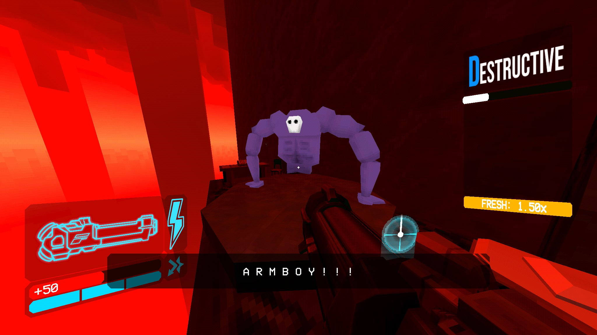
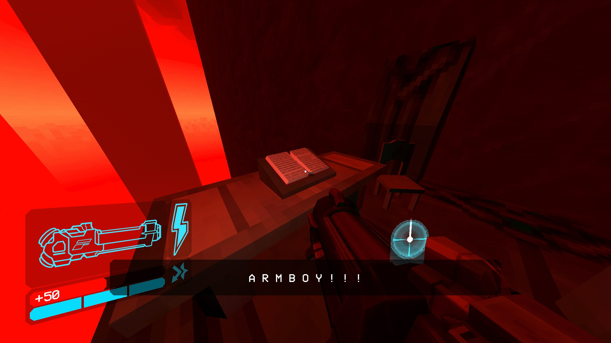
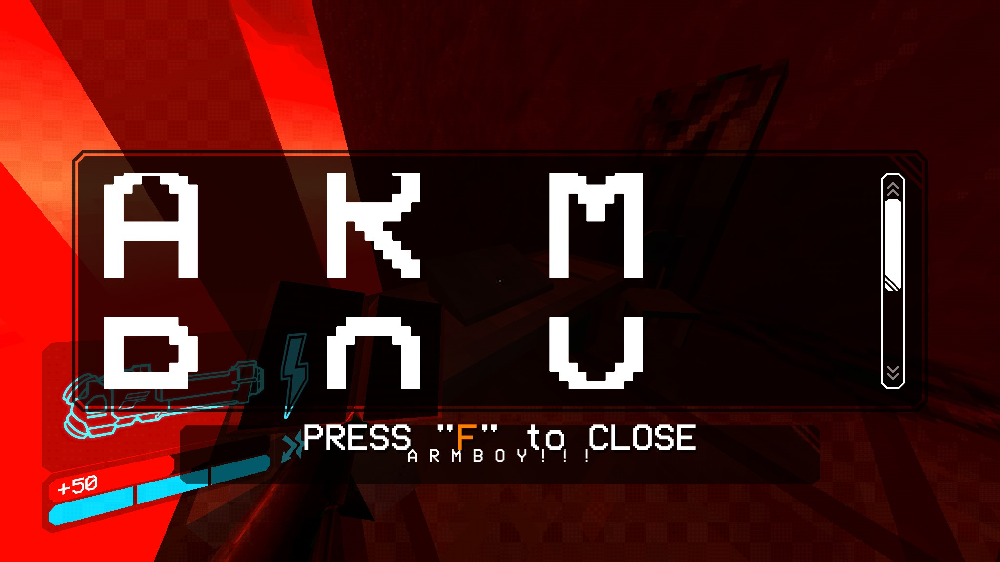

Alright, brace yourselves, hot take incoming: I really like ULTRAKILL. I know,
right? Somebody had to say it. There's not much to be said on the game itself
that would justify the bandwidth it would take to deliver similarly scalding hot
takes. But dropping the sarcasm for a moment, there is one community sentient I
take issue with. Specifically the non-engagement with the less "videogame-y"
parts.

Right off the bat, ULTRAKILL does not demand the level of seriousness I am about
to give it. There are a million examples I could point to, from the sandbox
literally being gm_construct to the museum that allows you to pick up and throw
marketable plushies of everyone who worked on the game. My personal favorite has
to be `A R M B O Y ! ! !`, a secret enemy that has the audacity to be placed
next to a book. In ULTRAKILL, books are usually used to convey lore. They're
some of the only holdable objects with 0 gameplay purpose, their exclusive
function is to deliver prose. When you get close to `A R M B O Y ! ! !`, his
name appears on screen, an effect that Hakita often uses to break kayfabe.

But then there's the book.

It's a really funny game. It's self-aware, and not in a quippy "I guess this is
something I do now" kind of way where it's almost embarrassed of what it is and
trying to offset that. It knows what it is, and it's _proud_ of it. Most
importantly, it has enough confidence in itself to break character for a gag
before resuming like nothing ever happened.And even then it has more sincerity
in its jokes than most games have in their climax.

Case in point, every layer in ULTRAKILL has a secret level. For the act finale
layers, these are the Prime Sanctums. These house secret super-bosses that take
up a considerable space in the lore, even more-so if you consider all the Greek
myths they grandfathered in. Others are Johnathan Blow's seminal work The
Witness, or for the young'uns reading this, the game The Looker was making fun
of. Even these joke levels are capped off with actual, literal testaments. As in
the written word of God with a capital G.
