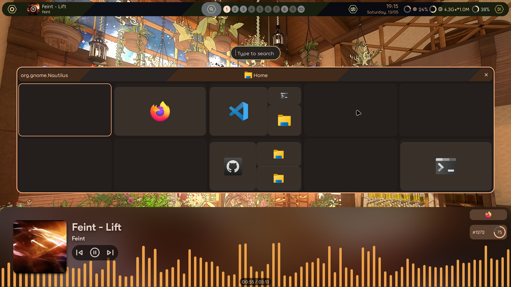
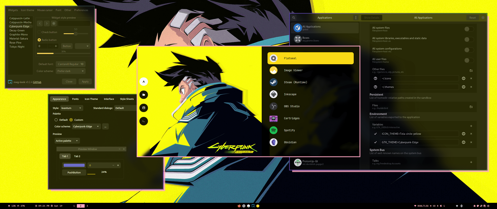

I love it when names have a deeper meaning behind them, both linguistically and
conceptually. Those etymology charts in online dictionaries always fascinated
me, like little maps of interpretation. Conceptually, I have SCP-4000 to thank
for my love of name-based magic. Oh, sorry I meant to say
<span style='color:green; font-weight: bold;'>THAT ONE PLACE WITH THE FAIRIES IN
A FOREST THAT CAN'T BE REFERRED TO WITH THE SAME NAME TWICE</span>.

But as you've probably guessed, today I want to talk about something named so
literally I can't help but love it. There's nothing to read into, nothing to
extract hidden meaning from. It's as subtle as a sledgehammer and as elegant as
a cinder-block. Dotfiles are called that because hidden items in a file manager
are prefixed with a period. Personally, this radical simplicity is a breath of
fresh air. Not just the name, but hiding sensitive files behind such a
straightforward barrier. Windows requires you to type out `%appdata%` every
single time, and sometimes it's in `%localappdata%` or the Documents folder or
some other app-specific folder. I've been confused by Linux's lack of a "Program
Files" folder but it's worth it if I can find the files I'll actually edit.

The main strength of Linux has always been its customization, but that
inevitably scares off people who don't care. It's like that old community
in-joke: "The best part of Linux is that you can customize anything, the worst
part of Linux is that you _have to_ customize _everything_". Thankfully, the
existence of a dotfiles folder partially negates this potential hurdle by making
it trivial to copy someone else's setup. Which brings me to the reason I wanted
to make this post, and the software I'm currently writing in...

##  Neovim

Neovim is a heavily refactored fork of
[Vim](<https://en.wikipedia.org/wiki/Vim_(text_editor)>) , which was a clone of
[VI](<https://en.wikipedia.org/wiki/Vi_(text_editor)>), which was the visual
mode of a command line text editor called
[EX](<https://en.wikipedia.org/wiki/Ex_(text_editor)>), which was an optimized
version of [ED](<https://en.wikipedia.org/wiki/Ed_(software)>), which was a Unix
port of [QED](<https://en.wikipedia.org/wiki/QED_(text_editor)>)[^1]. This is
relevant because beyond modernizing an ancient program, Neovim was designed for
extensibility. Fitting considering how far back its roots stretch. And make no
mistake, those roots are still there. EX was a complete rewrite, so only design
decisions remain from ED and QED, but beyond that? There's C code from the 70's
running under the hood, providing the exact same functionality it did back then.
Imagine if all software preservation was this easy! No emulation, no
compatibility layers, no nothing, just CPU instructions triggered on key press.

[^1]: Which stands for Quick EDitor, if you were wondering.

Anyway, the point of going over Neovim's dumb-as-bricks foundations was to show
how easily dotfiles can transform a program into something unrecognizable (and
if you aren't careful, something far less usable). As tempting as it is to copy
and paste someone else's setup, it really pays off to know the ins and outs of
whatever program you're configuring. That's always the tradeoff, technical
experience is never "optional", it just might take a while before it becomes
mandatory. Neovim's extensibility means that pre-configured setups aren't just
appealing, they're almost required. Thankfully, someone smarter than me _also_
noticed this and created a set of dotfiles that pulls double-duty as both a
functional configuration of Neovim, and an annotated guide to every part of the
program.

### Kickstart.nvim

[Kickstart.nvim](https://github.com/nvim-lua/kickstart.nvim) is a Neovim
configuration that I think everyone should use, at least to start with. A common
sentiment from more technically experienced folks towards new users is RTFM, or
Read The Fucking Manual. Back when you installed software from physical media,
this was more or less the expectation. No Clippy, no labels or visible keymaps,
you were just expected to spend a week going through >100 pages of technical
documentation covering every single function and use case. Kickstart.nvim
preserves some of this philosophy by heavily relying on the <kbd>leader</kbd> +
<kbd>s</kbd> + <kbd>h</kbd> command, which pulls up a search box that scrubs the
built-in manual for more detailed documentation on whatever you might need help
with. The only "required reading" is presented in a simple, no-frills, Mike
Ehrmantraut "Here's what you're gonna do" format.

> [!tip]
>
> So here's what you're gonna do. You're gonna go to Kickstart.nvim's GitHub
> page. You're gonna fork the repository, just like it tells ya. You're gonna
> install the dependencies listed in the README, doesn't matter which OS you're
> on, there's options for all of 'em. You're gonna find your Neovim config
> folder and clone your forked repository right in there, nice and clean. You're
> gonna open up your favorite terminal and type "nvim", if any errors pop up,
> you mucked something up. No big deal, just go back to the README and make sure
> you did every step just like it told ya. You're gonna keep doing that, and
> once you're done, you're gonna type ":Tutor". You're gonna do what it says
> until you got a basic grasp on Vim-style editing. Once you're confident in
> that department, you're gonna type ":e $MYVIMRC". From there, you read what it
> tells you, write it down if you have to, just pay attention and restart after
> any changes to avoid pouring over every line looking for which one caused an
> error. You got all that?


Well you better have, because up next are the advanced setups with a ton of
pre-configured features that are definitely more usable out of the box, but work
best as examples or inspiration, not an all-in-one shortcut.

### NVChad


A wildly popular choice, NVChad has a lot going for it. It's beautiful, for one
thing. It's clear a lot of work was put into their custom base46 theming plugin.
Their custom UI plugin as a whole does a lot of work in turning Neovim into
something that _looks_ like an IDE. Let's see the docs page for it!


Oh... That's helpful. Well what about base46? The theming plugin must have some
stuff about custom themes and whatnot, right?


Huh.

This is very much a "me thing" but this docs page really turned me off on
NVChad. The use of custom plugins for basic features is cool to see, they very
much do what they're supposed to, but it also reminds me of the walled gardens I
turned to Neovim to avoid. If you want to get base46 working with any other
plugin, you'll find that NVChad doesn't mix well with anything but itself. This,
to be clear, is totally fine on its own. NVChad already provides more than
enough, and I can say you'll have a fine experience even if you only use default
plugins. It's just not for me. Mostly because _another_ setup proves default
functionality and customization are not mutually exclusive.

### LazyVim


LazyVim is developed by the creator of the Lazy.nvim plugin manager, and was
designed explicitly to provide easy customization without starting from scratch.
The plugin manager itself is already the most popular one and is considered the
default by most plugin developers. Compatibility and extensibility are the real
strengths of this setup. Really, there's not much else to go over, everything
else that makes LazyVim great is just the inclusion of things I complained about
NVChad missing. Still check out kickstart first, but after that, I
wholeheartedly recommend LazyVim.

This whole "convenience vs customization" dichotomy is a common theme in
dotfiles. Hell, it's a theme in software as a whole. Arch is so customizable it
doesn't even ship with a GUI by default, which is why EndeavorOS and Manjaro
exist to fill that niche. It really exists on a sliding scale. NVChad is
convenient _because_ it's not very customizable, and vice versa for kickstart.
LazyVim just happens to strike a balance that appeals to me. Don't take my
recommendation at face value. Ask yourself what you want out of a Neovim config
and go from there. Or try them all and decide later! Another advantage of
dotfiles is dead-simple backups and restores. LazyVim even includes a simple
bash script that will do it automatically:

```bash
# required
mv ~/.config/nvim{,.bak}

# optional but recommended
mv ~/.local/share/nvim{,.bak}
mv ~/.local/state/nvim{,.bak}
mv ~/.cache/nvim{,.bak}
```

I say this because the next and last example of dotfiles I'd like to go over is
a lot harder to swap out whenever you please, because it configures something
much more fundamental than a text editor.

##  Hyprland



Hyprland is a lot harder to configure on your own, as it ships with no default
keybinds. Every single action must be set manually, and it's hard to know which
actions will be used more often without already having experience navigating a
tiling window manager. This is where pre-configured dotfiles would be really
useful, but the problem there is that each configuration has different bindings
for simple actions with the only common link being the use of the "Meta"[^2] key
as a modifier. That much makes sense, that button is normally only used for
basic desktop environment actions, and Hyprland is effectively filling that
role. But if you look at the list of official and unofficial desktop
environments on
[ArchWiki](https://wiki.archlinux.org/title/Desktop_environment), you won't find
Hyprland there. That's because the definition of a desktop environment is really
fuzzy and despite containing its own ecosystem of utilities, Hyprland is just a
lot easier to categorize as a Wayland compositor. This is _way_ more specific,
as it involves the bare-metal processes that decide which pixels light up and
when.

[^2]:
    Also called the "Super" key, but more easily recognizable as the Windows key

Writing a custom config for something so fundamental may seem daunting or
dangerous, but Wayland compositors are very easy to replace. Even if you mess
something up, the damage won't spread anywhere else, and you can easily boot
into a different compositor to fix things. There are 3 pre-configured setups I'd
like to take a look at, just like Neovim. But unlike Neovim, the whole
"convenience vs customization" scale doesn't stretch as far. Any DIY experience
similar to Kickstart.nvim would just have you staring at a blank screen, and
that's no way to learn. Instead, a more useful scale for Hyprland is "Dazzling
vs. Daily Driver".

Honestly I'm surprised it took me this long to talk about ricing, as it's a
pretty important part of dotfiles. The term is an acronym from car culture,
where RICE stands for "Race Inspired Cosmetic Enhancement"[^3]. A good example
is when you put a massive, flashy spoiler on an ordinary vehicle you'd find in
an office parking lot. Obviously your 2008 Honda Civic doesn't need any
downforce, it's not gonna lose grip going 70mph in a straight line. But because
high-performance racing cars have those features, they end up being desirable
even without the benefit it was designed to provide.

[^3]:
    It's worth mentioning that this is a post-hoc acronym. It's generally agreed
    that it's called "ricing" because it sounds like racing, and the practice
    started in Asian countries[^4].

[^4]:
    Sidenote to this sidenote, but I didn't expect so many car terms to end up
    in this post. Guess there's a lot in common between 2 groups obsessed with
    optimizing a machine past the point of practicality.

Hyprland ricing is kind of like that, because while many features are designed
for productivity, their inaccessible and technical nature can make you feel more
experienced, even if it's not necessarily making you more productive. The first
config I want to cover is literally called "My Linux For Work", and there are
still plenty of unnecessary flourishes that serve exclusively to make the
desktop more aesthetically pleasing.

### ML4W (My Linux For Work)


This config is firmly planted on the "Daily Driver" side of the spectrum. I
mean, you saw the title, it had to be abbreviated because who has the time to
type out "My Linux For Work" every time? This is a busy config for busy people.
But at the same time, the main reason tiling window managers are generally
faster is keyboard shortcuts, and if you're coming at this from a work
perspective, you're not gonna put aside an hour to learn how to use something
you don't technically need. Maybe this is biased from years of working with
boomers who never knew you could save a document with <kbd>CTRL</kbd> +
<kbd>S</kbd>, but the point still stands that if you expect people to use
something for work, you can't just chuck a manual at them and leave them to the
wolves.

This config comes with 3 main convenience tools: a configuration GUI app, a
dedicated keybind for searching keybinds, and a functional top-bar that ensures
every essential action is still doable with just a mouse. This might seem
similar to NVChad's walled garden approach, but the backend here isn't some
bespoke system, all it does is save whatever you punch into the inputs as
`~/.config/hypr/hyprland.conf`. It's the thinnest possible layer between the
user and their dotfiles, which is how it should be! My only problem with this
system is how it gets around the `.config` folder being hidden by default. In
order to have everything visible, it places a shortcut[^5] in your _actual_
.config folder that points to an entirely new folder in the user's home
directory.

[^5]:
    Technically a "symlink", meaning symbolic link, but it's basically the same
    thing. Symlink just sounds cooler and brings to mind the image of a portal
    connecting 2 points in your files. I guess it just feels more concrete when
    you can `cd` through a shortcut instead of just double-clicking it.

But, ultimately, this doesn't bother me nearly as much as NVChad. This bit of
restructuring can easily be worked around or fully reversed. This is still a
configuration for Hyprland, it's not trying to add exclusive systems or deeply
integrated apps like a fully-fledged desktop environment. That distinction goes
to the most popular Hyprland config on GitHub, and one that went through a major
restructuring while I was writing this.

### HyDE (formerly Hyprdots)


I gave this one a shot when it was still Hyprdots, and fully bounced off of it
when I saw that one of the themes was called "edge-runners" and looked like
this:



Looking back on it, that was pretty shallow of me, but the sentiment wasn't
necessarily faulty. There are a ton of rices out there that are fully themed
around a specific media property (usually anime), and that's a pretty reliable
sign that they were made specifically for 1 screenshot before reverting back to
something actually usable. Far from ML4W, this is closer to ML4Reddit. But it
seems this focus on style payed off, since their now abandoned GitHub repository
currently sits at 8.7k stars. While I wasn't looking, it appears the original
creator went radio silent and the only collaborator left forked the project with
a rebrand. They're currently putting the dotfiles through a major tune-up with a
clear plan moving forward, so give it a look if you know your way around
dotfiles or shell scripts, they could use the extra hands.

Anyway, since I am nothing if not predictable, there's a third option I
personally use and that I think bridges the gap between form and function in a
way that makes it easy to recommend. To avoid repetition, I'll try to write the
next section as a series of Haikus. Predictability was never in the cards.

### KooL's Hyprland Dots


This one's really fun

It's easy to customize

And easy to use

---

Works on more than Arch

Nix, Fedora, Ubuntu

Even Tumbleweed

---

No custom apps here

Just a bunch of helper scripts

That are bound to keys

---

Also I'm biased

I contributed some code

I love open source


## Conclusion

The phenomenon of dotfiles exemplifies my favorite part of open source. People
can just share what works for them and you can yank it for yourself, tear out
all the parts you don't like, and add whatever you want! It also just feels
great after years of putting up with a bunch of little annoyances with Windows
that Microsoft wouldn't let me fix. No wrestling with OneDrive, Edge, or
Updates, and if I **do** have to mess with something, there's not a
multi-billion dollar corporation working to make it harder. I will take 1000
dependency conflicts over 1 mandatory update every time.

Signing off: Wheelsbot

~~_Down in the .conf mines, and the shift never ends._~~
